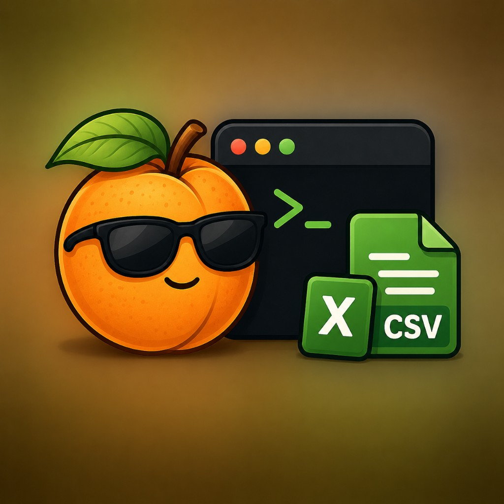

<p align="center">
  
</p>

# wild-apricot-exports

[](https://www.npmjs.com/package/wild-apricot-exports)
[](https://nodejs.org)
[](LICENSE)

Export and back up your [Wild Apricot](https://www.wildapricot.com/) data directly, without using the admin UI.

`wild-apricot-exports` pulls your data out of Wild Apricot via the public REST API (and WebDAV for files) and saves it locally as JSON, CSV, and the original uploaded files. You can use it as a CLI (`wa-export`) or as a Node library.

## What gets exported

| Subcommand                | Output                                                  | Source            |
| ------------------------- | ------------------------------------------------------- | ----------------- |
| `wa-export config`        | Account / membership levels / contact fields / settings | REST API          |
| `wa-export events`        | All events (with full detail payload)                   | REST API          |
| `wa-export registrations` | Event registrations                                     | REST API          |
| `wa-export contacts`      | Contacts / members                                      | REST API          |
| `wa-export invoices`      | Invoices                                                | REST API          |
| `wa-export payments`      | Payments                                                | REST API          |
| `wa-export donations`     | Donations                                               | REST API          |
| `wa-export audit-log`     | Audit log entries                                       | REST API          |
| `wa-export files`         | All uploaded files (Documents, Pictures, Logos, etc.)   | WebDAV            |
| `wa-export all`           | Runs every step above in sequence                       | REST API + WebDAV |
| `wa-export retry-events`  | Re-fetches events that failed during `events`           | REST API          |

REST exports are written as both `.json` (full payload) and `.csv` (flattened, spreadsheet-friendly). File exports preserve the original folder structure under `exports/files/`.

## Requirements

- Node.js 20+
- A Wild Apricot account with admin access
- A Wild Apricot **API key** (Settings → Authorized applications → Authorize application)
- For file export only: your Wild Apricot **admin login** (email + password) — the WebDAV server does not accept API keys

## Install

**Global CLI** (`wa-export` on your `PATH`):

```bash
npm install -g wild-apricot-exports
```

**One-off CLI** without a global install (`npx` can fetch the package when needed). Both binary names point at the same entrypoint:

```bash
npx wild-apricot-exports --help
# or
npx wa-export --help
```

**Inside another Node project** (use the library from code _or_ pin the CLI version alongside your app):

```bash
npm install wild-apricot-exports
```

Import from `"wild-apricot-exports"` in your code (see [Library usage](#library-usage)), or run `npx wa-export …` / `npx wild-apricot-exports …` from that project’s root so `node_modules/.bin` is resolved.

## Setup

The CLI reads credentials from environment variables (or a `.env` file in the working directory):

| Variable                      | Required                            | Description                                                             |
| ----------------------------- | ----------------------------------- | ----------------------------------------------------------------------- |
| `WILD_APRICOT_API_KEY`        | REST exporters & `all`; not `files` | API key from Settings → Authorized applications (`--api-key` overrides) |
| `WILD_APRICOT_ACCOUNT_ID`     | no                                  | Auto-discovered if omitted (`--account-id` overrides)                   |
| `WILD_APRICOT_WEBDAV_URL`     | only for `files`                    | e.g. `https://yourorg.wildapricot.org`                                  |
| `WILD_APRICOT_ADMIN_EMAIL`    | only for `files`                    | Admin login email                                                       |
| `WILD_APRICOT_ADMIN_PASSWORD` | only for `files`                    | Admin login password                                                    |
| `WILD_APRICOT_FILE_DIRS`      | no                                  | Comma-separated WebDAV directories to crawl (default: full root)        |

Quick start with a `.env` file:

```bash
echo "WILD_APRICOT_API_KEY=your-key-here" > .env
wa-export contacts
```

If you used a **local** install (`npm install wild-apricot-exports` without `-g`), run `npx wa-export contacts` instead of `wa-export contacts`.

## CLI usage

Run any individual exporter:

```bash
wa-export events
wa-export contacts
wa-export invoices --start-date 2026-01-01 --end-date 2026-12-31
wa-export payments
wa-export donations
wa-export registrations
wa-export audit-log
wa-export config
wa-export files
```

Or run everything at once:

```bash
wa-export all
wa-export all --exclude files          # skip the slow WebDAV crawl
wa-export all --include events,registrations
```

`wa-export all` runs each step sequentially and prints a summary at the end. A failure in one step does not stop the others.

Common options:

| Option                                              | Applies to                                        | Description                                    |
| --------------------------------------------------- | ------------------------------------------------- | ---------------------------------------------- |
| `--api-key <key>`                                   | REST exporters & `all`                            | Overrides `WILD_APRICOT_API_KEY`               |
| `--account-id <id>`                                 | REST exporters & `all`                            | Overrides `WILD_APRICOT_ACCOUNT_ID`            |
| `-o, --out-dir <dir>`                               | every command                                     | Root output directory (default: `./exports`)   |
| `-q, --quiet`                                       | every command                                     | Suppress progress (errors still print)         |
| `--start-date YYYY-MM-DD` / `--end-date YYYY-MM-DD` | invoices / payments / donations / audit-log / all | Restrict to a date range                       |
| `--include`, `--exclude`                            | `all`                                             | Comma-separated step lists                     |
| `--file-dirs`                                       | `files`, `all`                                    | Comma-separated top-level WebDAV dirs to crawl |
| `--request-delay-ms`                                | `events`, `registrations`, `retry-events`         | Override the per-request pacing                |
| `--save-every-n`                                    | `events`, `registrations`                         | Checkpoint cadence for resumable runs          |

Throttling and date filters from `.env` still work when you omit CLI flags (e.g. `WA_EVENT_REQUEST_DELAY_MS`, `INVOICES_START_DATE` / `INVOICES_END_DATE`, `AUDIT_START_DATE`, etc.).

Run `wa-export <subcommand> --help` (or `npx wa-export <subcommand> --help` when the CLI is only installed locally) to see every option for a given command.

## Output

Everything is written under `./exports/` (or whatever you pass to `--out-dir`):

```
exports/
  config/         account.json, membership-levels.json, contact-fields.json, ...
  events/         wild-apricot-events.json, wild-apricot-events.csv
  registrations/  registrations.json, registrations.csv
  contacts/       contacts.json, contacts.csv
  invoices/       invoices.json, invoices.csv
  payments/       payments.json, payments.csv
  donations/      donations.json, donations.csv
  audit-log/      audit-log.json, audit-log.csv
  files/          <original folder structure from WebDAV>
                  _manifest.json
```

## Library usage

The published package is **CommonJS** (`require`). TypeScript and many Node ESM setups can still use `import` via standard interop; plain CommonJS works out of the box.

**ESM / TypeScript-style `import`:**

```ts
import { exportContacts, exportEvents, exportAll, consoleLogger } from "wild-apricot-exports";

const result = await exportContacts({
  apiKey: process.env.WILD_APRICOT_API_KEY!,
  outDir: "./exports",
  logger: consoleLogger, // omit for silent
});

console.log(`Exported ${result.count} contacts to ${result.csvPath}`);
```

**CommonJS `require`:**

```js
const { exportContacts, consoleLogger } = require("wild-apricot-exports");

(async () => {
  const result = await exportContacts({
    apiKey: process.env.WILD_APRICOT_API_KEY,
    outDir: "./exports",
    logger: consoleLogger,
  });
  console.log(`Exported ${result.count} contacts to ${result.csvPath}`);
})();
```

### Library exports (quick reference)

Field-level typings and result shapes live in **`dist/index.d.ts`** after `npm install`, or in-repo in **`src/types.ts`**. REST helper option interfaces (`ApiFetchOptions`, `PaginateOptions`, etc.) are documented next to those functions in **`src/wa-api.ts`**.

#### Exporters and loggers

| Export                | Description                                                                                                         | Primary options                                                                                                         |
| --------------------- | ------------------------------------------------------------------------------------------------------------------- | ----------------------------------------------------------------------------------------------------------------------- |
| `exportConfig`        | Account, membership levels, contact fields, picklists, and related metadata as JSON files under `<outDir>/config/`. | `ConfigExportOptions` (same fields as baseline `ExportOptions`)                                                         |
| `exportEvents`        | All events including per-event detail payloads → JSON + CSV under `<outDir>/events/`.                               | `EventsExportOptions` — adds `requestDelayMs`, `saveEveryN`                                                             |
| `retryEventFailures`  | Re-fetches events that failed during a previous `exportEvents` run (same output tree).                              | `RetryEventFailuresOptions`                                                                                             |
| `exportRegistrations` | Registrations per event → JSON + CSV.                                                                               | `RegistrationsExportOptions` — optional `events`, `requestDelayMs`, `saveEveryN`                                        |
| `exportContacts`      | Contacts / members → JSON + CSV.                                                                                    | `ContactsExportOptions`                                                                                                 |
| `exportInvoices`      | Invoices → JSON + CSV.                                                                                              | `InvoicesExportOptions` — adds optional `startDate` / `endDate` (YYYY-MM-DD)                                            |
| `exportPayments`      | Payments → JSON + CSV.                                                                                              | `PaymentsExportOptions` — date range optional                                                                           |
| `exportDonations`     | Donations → JSON + CSV.                                                                                             | `DonationsExportOptions` — date range optional                                                                          |
| `exportAuditLog`      | Audit log → JSON + CSV.                                                                                             | `AuditLogExportOptions` — date range optional                                                                           |
| `exportFiles`         | Crawls WebDAV and downloads uploaded files under `<outDir>/files/`.                                                 | `FilesExportOptions` — **no `apiKey`**; requires `webdavUrl`, `adminEmail`, `adminPassword`                             |
| `exportAll`           | Runs export steps in order; one step failing does not stop the rest.                                                | `ExportAllOptions` — `include` / `exclude`, optional WebDAV fields when `files` runs, plus `*Options` partials per step |
| `consoleLogger`       | Stdout/stderr logger used by the CLI; pass as `logger` for human-readable progress.                                 | —                                                                                                                       |
| `silentLogger`        | Default when `logger` is omitted (no console noise).                                                                | —                                                                                                                       |

#### REST helpers (advanced)

Same OAuth, 429 backoff, and 401 refresh behavior as the exporters when you pass a `TokenManager` from `createTokenManager`.

| Export               | Description                                                                                            |
| -------------------- | ------------------------------------------------------------------------------------------------------ |
| `API_BASE`           | Wild Apricot REST base URL for v2.2 (`https://api.wildapricot.org/v2.2`).                              |
| `createTokenManager` | OAuth client-credentials manager; refreshes tokens before expiry and on 401.                           |
| `getAuthAndAccount`  | From `apiKey` (+ optional `accountId`): returns `{ token, tokenManager, accountId }` for custom calls. |
| `discoverAccountId`  | Resolves the account id from `GET /accounts` when you only have a token/manager.                       |
| `apiFetch`           | Authenticated `fetch` with retries, rate-limit handling, and JSON/XML parsing.                         |
| `apiGet`             | Convenience `GET` wrapper around `apiFetch`.                                                           |
| `paginate`           | Walks `$top` / `$skip` pages and returns a flat array of items.                                        |
| `asyncQuery`         | Starts or polls Wild Apricot async query endpoints until complete.                                     |
| `sleep`              | Promise-based delay that respects `AbortSignal`.                                                       |

#### Baseline options (most REST exporters)

`exportFiles` does **not** take `apiKey` (see table above). `exportAll` extends the baseline with orchestration and WebDAV-related fields.

```ts
interface ExportOptions {
  apiKey: string;
  accountId?: string | number; // auto-discovered if omitted
  outDir?: string; // default: "./exports"
  logger?: Logger; // default: silentLogger
  onProgress?(event: ProgressEvent): void;
  signal?: AbortSignal; // for cancellation
}
```

Each exporter returns a typed result (paths, counts, and step outcomes) — see **`dist/index.d.ts`** or **`src/types.ts`**.

Cancellation example:

```ts
const ac = new AbortController();
setTimeout(() => ac.abort(), 30_000);

await exportEvents({
  apiKey: process.env.WILD_APRICOT_API_KEY!,
  signal: ac.signal,
});
```

## Notes

- **Resumability.** `events`, `registrations`, and `files` all maintain a partial-state file in their output directory and pick up where they left off if interrupted.
- **Rate limiting.** The library handles 429s automatically with exponential backoff (honoring `Retry-After` when present), and refreshes expired access tokens mid-run on 401.
- **WebDAV uses HTTP Digest auth.** Wild Apricot's WebDAV endpoint returns 500 on Basic auth; the file exporter handles this automatically.
- **By default, `wa-export files` crawls everything under `/` recursively** (including files at the root). If listing `/` 500s on your account, pass `--file-dirs` to scope the crawl (e.g. `--file-dirs Documents,Pictures,Logos,Theme,SiteUploads`).
- **Audit log retention** is limited by Wild Apricot (often 30–90 days depending on plan). Older entries simply return nothing.
- **Date filters** for invoices, payments, donations, and the audit log are optional. Omit them to fetch everything.

## Development

From a git checkout you run the same CLI via `node bin/wa-export.js` (after `npm run build`). The `npm run export-*` script names are convenience aliases that forward to `wa-export`:

```bash
git clone https://github.com/JustinPaoletta/wild-apricot-exports.git
cd wild-apricot-exports
npm install
npm run lint
npm run format:check
npm run build
npm test
npm run test:coverage
node bin/wa-export.js --help
```

`npm run build:watch` rebuilds on save during development.

## Contributing

See [CONTRIBUTING.md](CONTRIBUTING.md). [Code of conduct](CODE_OF_CONDUCT.md).

## License

MIT
